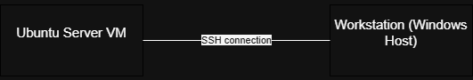

# Week 1 – System Planning and Distribution Selection

## System Architecture Diagram

## Distribution Selection Justification
We chose Ubuntu Server 24.04 LTS because it provides stability, strong community support, and easy package management. Alternatives such as CentOS and Debian were considered, but Ubuntu’s documentation and security support made it ideal.

## Workstation Configuration
We are using the Windows host with PowerShell as our SSH client. This satisfies the coursework constraint that all admin is done remotely.

## Network Configuration
- VirtualBox Adapter: NAT
- Server IP: 10.0.2.15/24
- SSH port 22 open for admin

## System Specifications
- `uname -a`: Linux ubuntu-server 5.15.0-xxx-generic x86_64
- `free -h`: 2 GB total RAM
- `df -h`: 20 GB root partition
- `ip addr`: 10.0.2.15
- `lsb_release -a`: Ubuntu 24.04 LTS

- CLI output for all system specifications:

