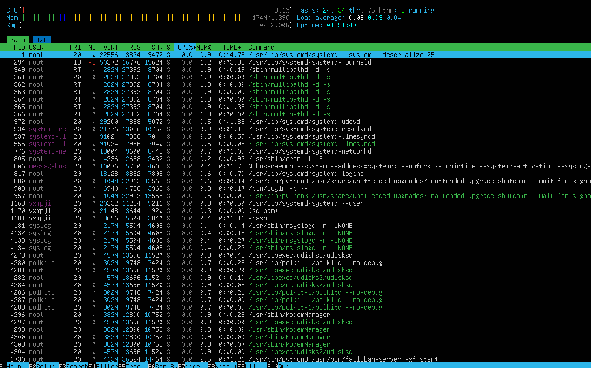
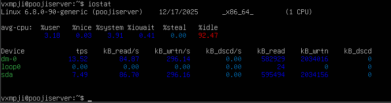
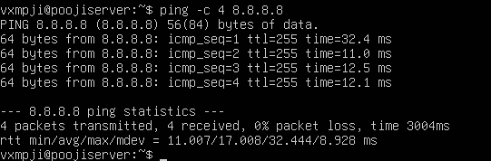
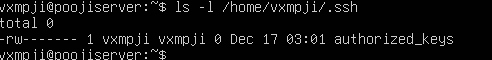
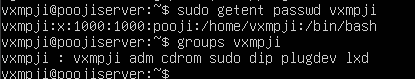
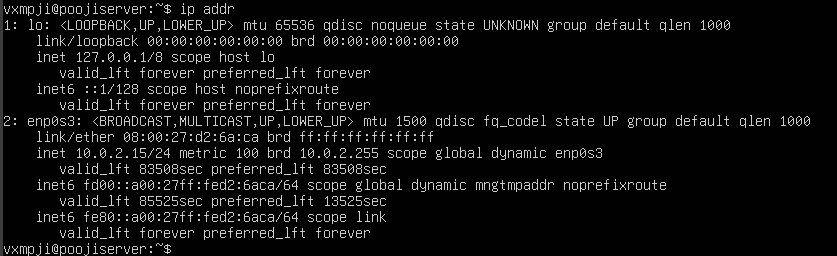
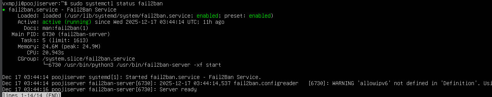

# Week 2 – Security Planning and Testing Methodology

## Performance Testing Plan

This week, I focused on designing a comprehensive performance testing plan for monitoring the Ubuntu server remotely via SSH. The goal is to capture CPU usage, memory consumption, disk I/O, and network performance using standard command-line tools. The monitoring approach includes `htop` for real-time CPU and memory usage, `vmstat` for system statistics, `iostat` for disk performance, and `ping` for basic network latency checks. This approach ensures that the server’s behavior under various workloads can be systematically observed and documented.

## Security Configuration Checklist

To establish a strong security baseline, I implemented the following controls on the server:

1. **SSH Hardening**: Key-based authentication is configured, and password authentication has been disabled to reduce the risk of brute-force attacks.  

2. **Firewall Configuration**: The server firewall (`ufw`) is enabled, allowing only SSH connections from my workstation IP.  

3. **Mandatory Access Control**: AppArmor is enabled and enforcing, restricting unauthorized access to critical system files.  

4. **Automatic Security Updates**: Unattended upgrades are enabled to ensure the server automatically applies security patches.  

5. **User Privilege Management**: A non-root administrative user has been created with `sudo` privileges, and direct root login is disabled.  

6. **Network Security**: SSH access is restricted to a specific workstation IP, minimizing exposure to external threats.  

7. **Fail2Ban**: Fail2Ban is installed and configured to monitor SSH login attempts and block repeated failed attempts.  

## Threat Model

Three primary security threats were identified and mitigated:

- **Brute-force SSH attacks**: Prevented using key-based authentication and Fail2Ban.  
- **Unauthorized root access**: Mitigated by disabling root login and managing administrative privileges through a non-root user with sudo.  
- **Unpatched vulnerabilities**: Addressed by enabling automatic security updates, ensuring the server remains protected against known exploits.

This week’s work provides a secure and monitored foundation for the server, ensuring both baseline security and measurable system performance are in place before installing applications and conducting performance testing in later weeks.
