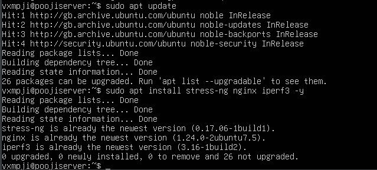

# Week 3: Application Selection for Performance Testing

## Application Selection
For Week 3, I selected five applications representing different workload types to evaluate the Linux server's performance.  
- **CPU-intensive:** `stress-ng` generates high CPU load.  
- **RAM-intensive:** `stress-ng` allocates memory to test usage.  
- **Disk I/O:** `dd` simulates heavy read/write operations.  
- **Network-intensive:** `wget` downloads a large file to simulate network traffic.  
- **Server application:** `nginx` is installed to observe performance under service conditions.  

These applications collectively cover CPU, memory, disk, network, and server workloads, providing a comprehensive performance evaluation.

## Installation Evidence
The following screenshot shows the installation of all applications on the Ubuntu server via SSH:

## Expected Resource Profiles
| Application     | Expected CPU | Expected RAM | Expected Disk I/O | Expected Network |
|-----------------|-------------|-------------|-----------------|----------------|
| stress-ng CPU   | High        | Low         | Low             | None           |
| stress-ng RAM   | Medium      | High        | Low             | None           |
| dd I/O test     | Low         | Low         | High            | None           |
| wget test       | Low         | Low         | Low             | High           |
| nginx           | Medium      | Medium      | Medium          | Medium         |

## Monitoring Evidence
### CPU & RAM
  

### Disk I/O

### Network

### Server Application

## Monitoring Strategy
The monitoring strategy involved observing resource usage while each application ran:  
- **CPU and memory:** monitored using `htop`.  
- **Disk I/O:** measured using `iostat`.  
- **Network throughput:** monitored during file transfers using `wget` or `iperf3`.  
- **Server application:** verified via `systemctl status` and checking response through a browser.  

All screenshots above demonstrate the successful execution of each test.
