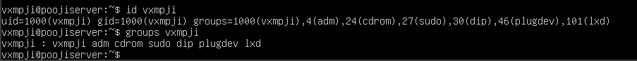
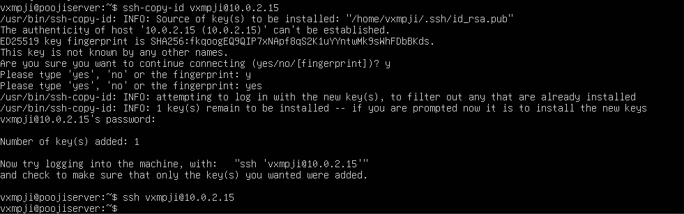
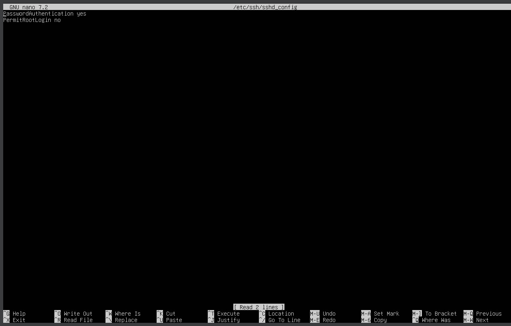
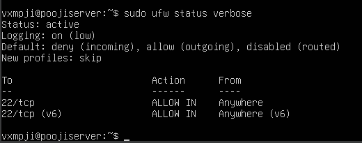
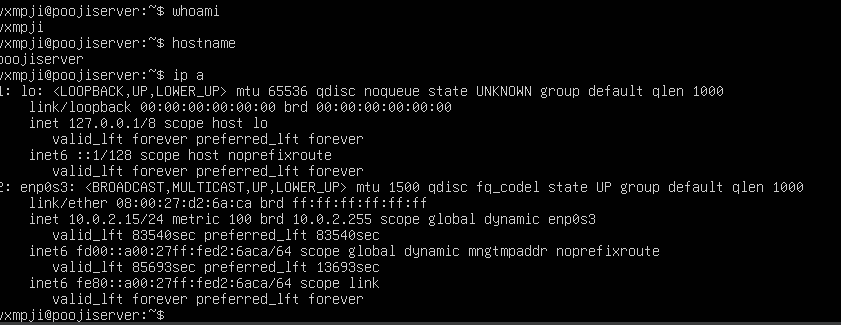

# Week 4: Initial System Configuration & Security Implementation

## Overview
In Week 4, foundational security controls were implemented on the Ubuntu Server system. 
All administration was performed remotely via SSH from the workstation, in accordance with the assessment constraints. 
This phase focused on securing remote access, enforcing least-privilege principles, and restricting network exposure using firewall rules.

---

## Non-Root Administrative User
A dedicated non-root administrative user was created to reduce the security risks associated with direct root access. 
This user was granted sudo privileges to perform administrative tasks when required.

This approach follows the principle of least privilege and improves accountability by separating administrative actions from the root account.

---

## SSH Key-Based Authentication
SSH key-based authentication was configured to replace password-based authentication. 
This significantly improves security by preventing brute-force password attacks and ensuring only authorised clients can connect.

An SSH key pair was generated on the workstation and the public key was securely copied to the server.

---

## SSH Hardening Configuration
The SSH daemon configuration was hardened by disabling root login and password authentication. 
These changes reduce the attack surface of the system and enforce secure authentication practices.

The SSH configuration file was modified and the SSH service restarted to apply the changes.

---

## Firewall Configuration
The Uncomplicated Firewall (UFW) was configured to restrict network access to the server. 
Only SSH connections from the workstation IP address were permitted, and all other incoming traffic was denied by default.

This ensures the server is not exposed to unnecessary network services.

---

## Remote Administration Evidence
All configuration tasks were performed remotely via SSH from the workstation system. 
This demonstrates correct remote administration practice and compliance with the assessment requirements.

---

## Summary
By implementing key-based SSH authentication, enforcing user privilege separation, and configuring strict firewall rules, 
the Ubuntu Server system was significantly hardened against unauthorised access. 
These security controls provide a secure baseline for advanced monitoring and performance testing in later phases.
