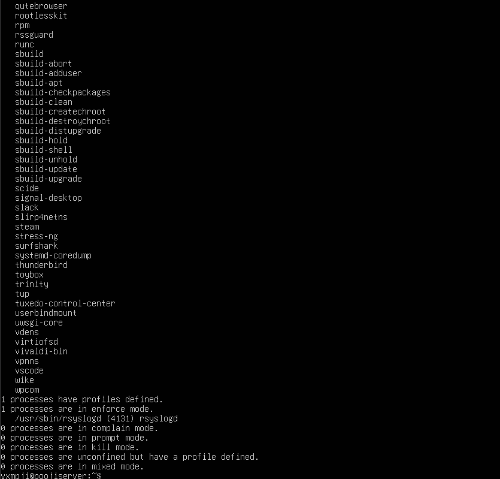
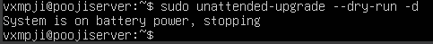
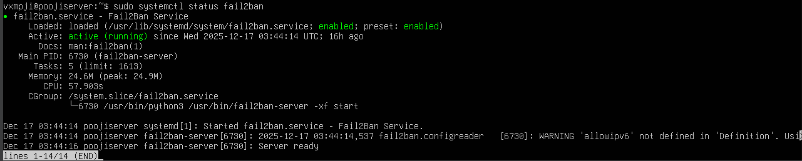
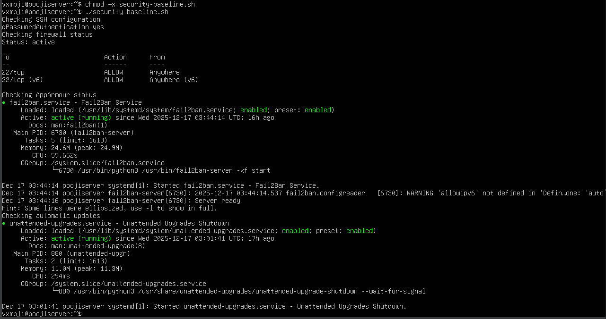
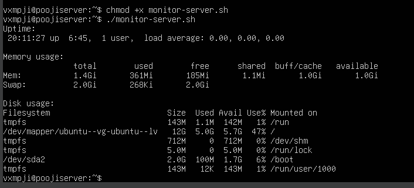

# Week 5: Advanced Security and Monitoring Infrastructure

## Overview
In Week 5, advanced security controls and monitoring capabilities were implemented on the Ubuntu Server system.  
All administration was performed remotely via SSH from the workstation, in accordance with the assessment requirements.  
This phase focused on enforcing mandatory access control, automating security updates, implementing intrusion detection, and developing scripts for security baseline verification and remote performance monitoring.

---

## Access Control: AppArmor
AppArmor was configured to enforce mandatory access control policies on the server.  
This helps prevent unauthorized access or modification of critical system files and processes.

---

## Automatic Security Updates
Automatic updates were configured to ensure the server consistently applies security patches without manual intervention.  
This reduces the risk of vulnerabilities being exploited.

---

## Intrusion Detection with fail2ban
Fail2ban was installed and configured to monitor SSH login attempts.  
It automatically bans IP addresses with repeated failed login attempts, reducing the risk of brute-force attacks.

---

## Security Baseline Verification Script
A script (`security-baseline.sh`) was created to verify all security configurations from Phases 4 and 5.  
This script checks SSH settings, firewall rules, user privileges, automatic updates, and AppArmor policies.

---

## Remote Monitoring Script
A remote monitoring script (`monitor-server.sh`) was developed to collect performance metrics from the server.  
The script gathers CPU, memory, disk, and network usage while connecting via SSH from the workstation.

---

## Summary
By implementing mandatory access control, automated security updates, intrusion detection, and monitoring scripts,  
the Ubuntu Server system is significantly more secure and manageable.  
These controls create a reliable foundation for performance evaluation in Week 6.
