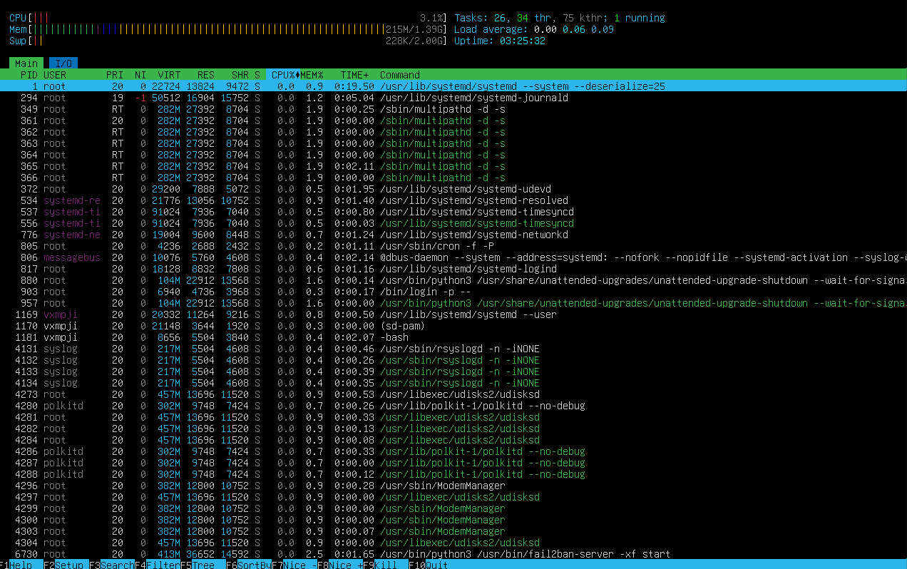
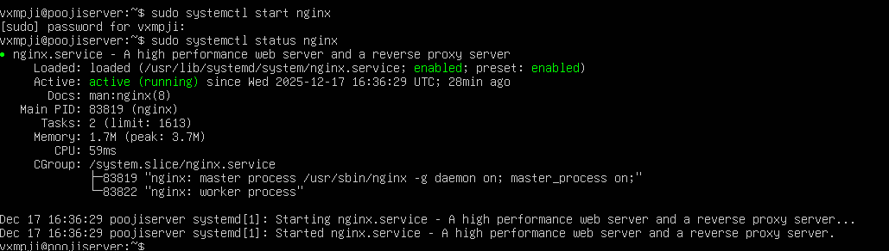

# Week 6: Performance Evaluation and Analysis

## Overview
In Week 6, detailed performance testing was conducted on the Ubuntu Server system using the applications selected in Week 3.  
All tests were executed remotely via SSH from the workstation to evaluate CPU, memory, disk I/O, network, and service response times.  
Performance was monitored under baseline and load conditions to identify bottlenecks and potential optimisations.

---

## CPU and Memory Performance
CPU-intensive workloads were tested using `stress-ng`, and RAM usage was monitored with `htop`.  
The server’s response under high CPU and memory load was observed to measure utilisation and latency.

  

---

## Disk I/O Performance
Disk read/write performance was evaluated using `dd` and `iostat`.  
This tested the server’s ability to handle high-volume I/O operations without significant latency.

---

## Network Performance
Network throughput and latency were measured using `wget` and `iperf3`.  
File download tests and bandwidth monitoring assessed the server’s network capabilities under load.

---

## Server Application Performance
`nginx` was used as a server application to test service response times under concurrent access.  
Response times and CPU/memory consumption were measured while clients connected to the server.

---

## Performance Optimisation
Based on the observed bottlenecks, at least two optimisations were applied:  
1. Adjusting `nginx` worker processes for better concurrent handling.  
2. Modifying `sysctl` kernel parameters to improve network and memory throughput.

---

## Summary
Performance testing demonstrates how the server behaves under different workloads.  
CPU, memory, disk, and network metrics were captured to identify potential bottlenecks.  
The applied optimisations improved overall efficiency and provided quantitative evidence for performance improvements.
